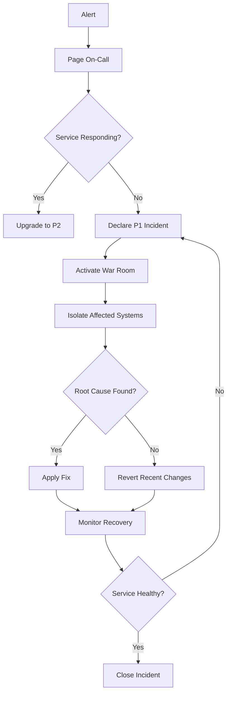

# Incident Response Plan

Structured incident response procedures.

## Overview

Well-defined incident response ensures rapid, coordinated crisis management.

## Severity Levels

| Level | Description | Response Time | Escalation |
|-------|-------------|----------------|------------|
| **P1** | Complete service down, data loss | 15 min | CEO, VP Eng |
| **P2** | Major feature unavailable, partial outage | 1 hour | VP Eng, Lead Eng |
| **P3** | Minor feature issue, degraded performance | 4 hours | Team Lead |
| **P4** | Non-critical bug, cosmetic issue | 24 hours | Individual Engineer |

## On-Call Rotation

```yaml
# on-call-schedule.yml
oncall:
  - name: "Alice Engineer"
    start: "2024-01-01T00:00:00Z"
    end: "2024-01-08T00:00:00Z"
    primary: true
    backup: "Bob Developer"

  - name: "Bob Developer"
    start: "2024-01-08T00:00:00Z"
    end: "2024-01-15T00:00:00Z"
    primary: true
    backup: "Charlie DevOps"
```

## Incident Triage

### Initial Response

```
1. DETECT - Alert triggered
   └─ Alert received at: __________
   └─ Severity: P1 / P2 / P3 / P4

2. ACKNOWLEDGE - Page on-call engineer
   └─ Acknowledged by: __________
   └─ Acknowledged at: __________

3. ASSESS - Gather information
   └─ Affected service: __________
   └─ Number of users impacted: __________
   └─ Revenue impact: $__________

4. DECLARE - Declare incident
   └─ Incident ID: INC-__________
   └─ Commander: __________
   └─ Severity: P1 / P2 / P3 / P4
```

### War Room Setup

```bash
#!/bin/bash
# scripts/incident/setup-war-room.sh

INCIDENT_ID=$1
SLACK_CHANNEL="incident-${INCIDENT_ID}"

# Create Slack channel
slack create #${SLACK_CHANNEL}

# Invite team
slack invite @commander @communications @engineering

# Create incident doc
incident_doc="https://docs.flowpay.stellar/incident/${INCIDENT_ID}"
echo "Incident doc: ${incident_doc}"

# Start recording
zoom start-recording --room "incident-war-room"

# Update status page
status_page_update "🔴 Major outage detected"
```

### Communication Template

```markdown
# Incident: [INCIDENT_ID]

**Start Time:** [TIME]
**Severity:** P1/P2/P3/P4
**Impact:** [Brief description]

## Status

🔴 **ONGOING** | 🟡 **INVESTIGATING** | 🟢 **RESOLVED**

## Latest Update

[Most recent status - Updated: HH:MM UTC]

## Affected Services

- [ ] API
- [ ] Frontend
- [ ] Database
- [ ] Payments
- [ ] Workflows

## Impact

- Users affected: ~XXXX
- Services down: YYY
- Estimated revenue loss: $ZZZ/hr

## Investigation

1. **Initial observation:** 
2. **Root cause hypothesis:**
3. **Affected components:**

## Actions Taken

- [x] Incident declared
- [ ] Service isolated
- [ ] Rollback initiated
- [ ] Data corrected
- [ ] Service restored

## Timeline

| Time (UTC) | Update |
|-----------|--------|
| 14:30 | Alert triggered |
| 14:32 | Incident declared |
| 14:45 | Root cause identified |
| 15:00 | Fix deployed |
| 15:05 | Service restored |

## Next Steps

- [ ] Monitor recovery
- [ ] Verify all systems
- [ ] Begin root cause analysis
- [ ] Update status page
```

## Response Workflows

### P1: Complete Service Outage



### P2: Major Feature Down

```
1. Acknowledge alert (5 min)
2. Gather metrics and logs (10 min)
3. Isolate root cause (15 min)
4. Implement fix (20 min)
5. Test fix (10 min)
6. Deploy fix (5 min)
7. Monitor (ongoing)
8. Post-mortem (within 24 hours)
```

### P3: Degraded Performance

```
1. Monitor metrics (10 min)
2. Identify bottleneck (15 min)
3. Apply temporary fix (20 min)
4. Schedule permanent fix (later)
5. Track improvement (ongoing)
```

## Runbook Examples

### Database Connection Pool Exhausted

```bash
#!/bin/bash

# Check pool status
kubectl exec -it postgres-0 -n flowpay-prod -- \
  psql -U admin -d flowpay -c "SELECT * FROM pg_stat_activity;"

# Identify idle connections
kubectl exec -it postgres-0 -n flowpay-prod -- \
  psql -U admin -d flowpay -c "SELECT pid FROM pg_stat_activity WHERE state = 'idle';"

# Kill idle connections
kubectl exec -it postgres-0 -n flowpay-prod -- \
  psql -U admin -d flowpay -c "SELECT pg_terminate_backend(pid) FROM pg_stat_activity WHERE state = 'idle';"

# Restart connection pooler
kubectl rollout restart statefulset/pgbouncer -n flowpay-prod

# Monitor recovery
watch -n 1 'kubectl logs -f deployment/backend -n flowpay-prod | grep "connection"'
```

### Memory Leak

```bash
#!/bin/bash

# Check memory usage
kubectl top pods -n flowpay-prod

# Get heap dump
kubectl exec deployment/backend -n flowpay-prod -- \
  node --inspect=0.0.0.0:9229 dist/main.js

# Connect DevTools
# chrome://inspect -> Connect to pod

# If immediate fix needed: restart pod
kubectl rollout restart deployment/backend -n flowpay-prod
```

### High Error Rate

```bash
#!/bin/bash

# Check error logs
kubectl logs -f deployment/backend -n flowpay-prod --all-containers=true | grep ERROR

# Check error metrics
curl http://prometheus:9090/query?query=rate(errors_total[5m])

# Check deployment rollout
kubectl rollout status deployment/backend -n flowpay-prod

# Rollback if recent deployment
kubectl rollout undo deployment/backend -n flowpay-prod
```

## Post-Incident Actions

### Blameless Post-Mortem

**Within 48 hours of incident closure:**

```markdown
# Post-Mortem: [INCIDENT_ID]

## Executive Summary
- What happened: [2-3 sentences]
- Duration: [Time]
- Impact: [Users affected, revenue]

## Timeline (in UTC)
| Time | Event |
|------|-------|
| 14:30 | Alert fired |
| 14:35 | Incident declared |
| 15:00 | Service restored |

## Root Cause
[Technical explanation of why it happened]

## Triggers
[What caused the issue to occur]

## Contributing Factors
- [Factor 1]
- [Factor 2]

## Mitigation
[How it was fixed]

## Detection
[How we detected it]

## Impact
- Users affected: X
- Revenue impact: $Y
- Reputation: [Assessment]

## Action Items
- [ ] Implement monitoring for X (Owner: Alice, Due: Jan 20)
- [ ] Add integration test for Y (Owner: Bob, Due: Jan 15)
- [ ] Update runbook for Z (Owner: Charlie, Due: Jan 10)

## Lessons Learned
1. [What did we learn?]
2. [What will we do differently?]

## Attendees
- Alice (Commander)
- Bob (Engineering)
- Charlie (DevOps)
```

### Metrics to Track

```typescript
@Injectable()
export class IncidentMetrics {
  async recordIncident(incident: Incident) {
    this.incidentsTotal.inc();
    this.incidentsBySeverity.labels(incident.severity).inc();
    this.incidentsDuration.observe(incident.duration);
    
    // Alert to Datadog
    await this.datadog.event({
      title: `Incident: ${incident.title}`,
      text: incident.description,
      priority: incident.severity === 'P1' ? 'high' : 'normal'
    });
  }
}
```

## Escalation Matrix

```
Primary On-Call ──┬──→ (response < 15 min)
                  │
                  └──→ VP Engineering ──→ (no response < 30 min)
                                  │
                                  └──→ CEO ──→ (no response < 60 min)
```

## Prevention

```bash
# Continuous chaos engineering
chaos-monkey --target production --intensity medium

# Regularly test incident response
./scripts/incident/drill-p1.sh

# Load testing
k6 run load-test.js --duration 30s --vus 1000

# Canary deployments
kubectl apply -f canary/deployment.yaml
# Monitor for 30 minutes before full rollout
```

## Best Practices

✅ **Do:**
- Respond quickly
- Communicate clearly
- Document everything
- Blameless reviews
- Test procedures
- Update runbooks
- Track metrics
- Learn from incidents

❌ **Don't:**
- Blame individuals
- Skip post-mortems
- Ignore patterns
- Leave systems down
- Hide incidents
- Forget to follow up
- Skip updates
- Repeat mistakes

## Resources

- [Google SRE Book - Incident Response](https://sre.google/sre-book/managing-incidents/)
- [Blameless Post-Mortems](https://www.etsy.com/codeascraft/blameless-postmortems/)
- [Incident Commander Guide](https://incident.io/incident-commander-guide)
